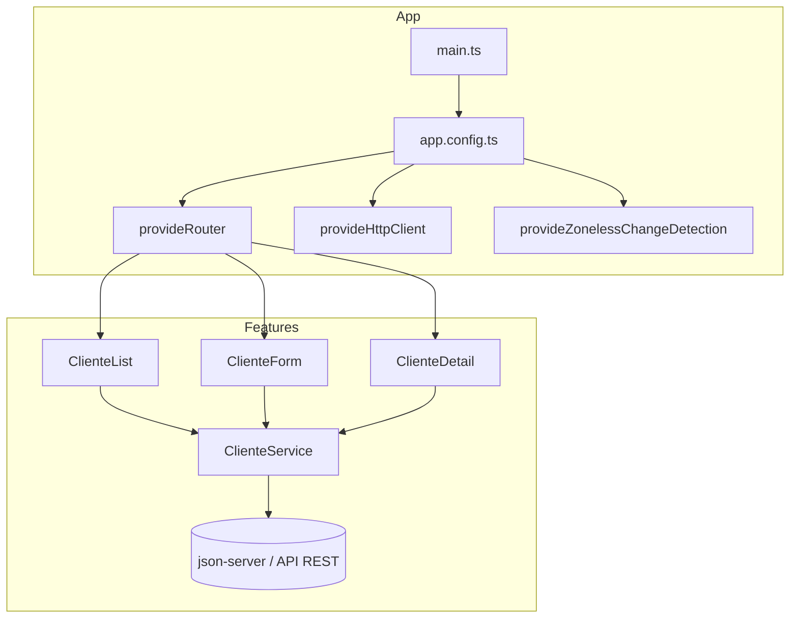
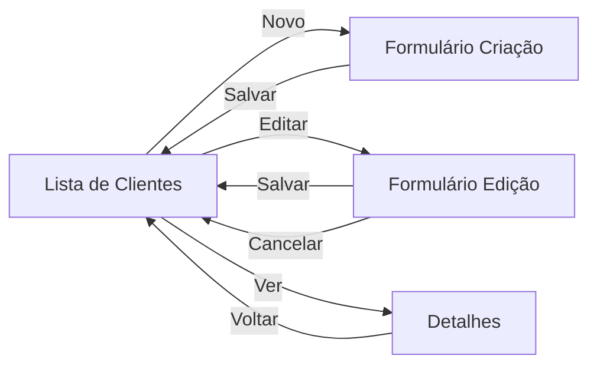

# Angular Moderno: Estrutura e Configuração de Projetos (17 → 22)

**Guia Definitivo de Desenvolvimento Moderno com Angular**

**Autor:** Arquiteto de Software especialista em Angular e TypeScript  
**Baseado em:** Documentação oficial (angular.dev), Style Guide oficial, RFCs e práticas recomendadas do time Angular (2023–2026)  
**Escopo:** Angular 17, 18, 19, 20, 21 e 22

> Este documento é um **manual prático de referência**. Ele mostra **como se desenvolve Angular hoje**, comparando continuamente com as práticas antigas (NgModules, *ngIf, HttpClientModule, Zone.js obrigatório, etc.).

---

## Sumário

1. [Criação do Projeto](#1-criação-do-projeto)
2. [Estrutura Inicial do Projeto](#2-estrutura-inicial-do-projeto)
3. [Bootstrap da Aplicação](#3-bootstrap-da-aplicação)
4. [Standalone Components](#4-standalone-components)
5. [Imports](#5-imports)
6. [Novo Control Flow](#6-novo-control-flow)
7. [Formulários e CRUD de Clientes](#7-formulários-e-crud-de-clientes)
8. [Reactive Forms em Profundidade](#8-reactive-forms-em-profundidade)
9. [Componentização](#9-componentização)
10. [Services](#10-services)
11. [Consumo de APIs](#11-consumo-de-apis)
12. [HttpClient em Detalhe](#12-httpclient-em-detalhe)
13. [Rotas](#13-rotas)
14. [Organização do Projeto](#14-organização-do-projeto)
15. [Signals](#15-signals)
16. [Injeção de Dependência](#16-injeção-de-dependência)
17. [Mudanças de Imports (Tabela)](#17-mudanças-de-imports-tabela)
18. [Antes × Depois (Tabela Comparativa 17–22)](#18-antes--depois-tabela-comparativa-17–22)
19. [Boas Práticas](#19-boas-práticas)
20. [Projeto Completo de Exemplo](#20-projeto-completo-de-exemplo)

---

## 1. Criação do Projeto

### Comando básico

```bash
ng new nome-do-projeto
```

A partir do Angular 17 o CLI faz várias perguntas interativas. Abaixo está a evolução de cada pergunta e a recomendação moderna (Angular 21/22).

### Perguntas da CLI e recomendações

| Pergunta | Angular 17–18 | Angular 19–20 | Angular 21–22 (recomendado) | Explicação |
|----------|---------------|---------------|-----------------------------|----------|
| **Would you like to add Angular routing?** | Yes | Yes | **Yes** | Quase todo app real precisa de rotas. |
| **Which stylesheet format would you like to use?** | CSS / SCSS / Sass / Less | Idem | **SCSS** | Mais poderoso, suporte a variáveis, nesting e mixins. |
| **Do you want to enable Server-Side Rendering (SSR) and Static Site Generation (SSG/Prerendering)?** | No (maioria) | Pergunta aparece | **Yes** se SEO/performance importar | Em 19+ a pergunta é mais clara. Em 21+ o suporte a hybrid rendering está maduro. |
| **Do you want to create a 'zoneless' application?** | Não existia | Experimental | **Yes (default em 21+)** | Zoneless é o futuro. Novos projetos já nascem sem Zone.js. |
| **Which test runner would you like to use?** | Karma | Karma | **Vitest** (default 21+) | Vitest é 5–10× mais rápido. |

### Comando completo recomendado (Angular 22)

```bash
ng new meu-app \
  --routing \
  --style=scss \
  --ssr \
  --skip-git=false
```

(Na prática a CLI já escolhe zoneless + Vitest por default a partir da v21.)

### Diferenças na estrutura gerada

| Item | Angular 17 | Angular 19 | Angular 21/22 |
|------|------------|------------|---------------|
| `standalone` | Opcional (muitos ainda usavam NgModule) | **Default true** | Default true |
| Zone.js | Sempre presente | Presente | **Ausente por default** |
| Test runner | Karma + Jasmine | Karma | **Vitest** |
| Suffixes de arquivo | `.component.ts`, `.service.ts` | Ainda gera | **Não gera mais** (Style Guide 20+) |
| `app.config.ts` | Já existe | Existe | Existe + providers zoneless |
| Builder | Application Builder (early) | Application Builder | `@angular/build` consolidado |

### Arquivos gerados (Angular 22 típico)

```
meu-app/
├── public/                 # assets estáticos (substitui src/assets em muitos casos)
├── src/
│   ├── app/
│   │   ├── app.ts          # componente raiz (sem .component)
│   │   ├── app.config.ts
│   │   ├── app.routes.ts
│   │   └── app.html / app.scss
│   ├── index.html
│   ├── main.ts
│   └── styles.scss
├── angular.json
├── package.json
├── tsconfig.json
├── tsconfig.app.json
├── tsconfig.spec.json
└── ...
```

---

## 2. Estrutura Inicial do Projeto

### Visão geral dos arquivos e pastas

```
src/
├── app/                    # Todo o código da aplicação
│   ├── app.ts              # Componente raiz
│   ├── app.config.ts       # Providers da aplicação (o antigo AppModule)
│   ├── app.routes.ts       # Rotas
│   ├── app.html
│   └── app.scss
├── index.html              # HTML de entrada
├── main.ts                 # Bootstrap
├── styles.scss             # Estilos globais
public/                     # Arquivos estáticos servidos na raiz (favico, robots.txt…)
angular.json                # Configuração do workspace e builders
package.json                # Dependências e scripts
tsconfig*.json              # Configuração do TypeScript + Angular compiler
```

### Função de cada arquivo importante

| Arquivo | Função |
|---------|--------|
| `main.ts` | Ponto de entrada. Chama `bootstrapApplication`. |
| `app.config.ts` | Substitui o antigo `AppModule`. Contém todos os `providers`. |
| `app.routes.ts` | Definição das rotas (usado por `provideRouter`). |
| `app.ts` | Componente raiz (`selector: 'app-root'`). |
| `angular.json` | Define projects, builders (build, serve, test), styles, assets, budgets. |
| `package.json` | Dependências, scripts (`start`, `build`, `test`). |
| `tsconfig.json` | Configuração base do TypeScript. |
| `tsconfig.app.json` | Configuração específica para a aplicação. |
| `styles.scss` | Estilos globais (reset, variáveis, temas). |
| `index.html` | Shell HTML. O Angular injeta o app dentro de `<app-root>`. |

### Evolução de pastas

- **Angular 17**: ainda era comum ter `src/environments/` e `src/assets/`.
- **Angular 19+**: `public/` ganha destaque para assets estáticos.
- **Angular 20+**: Style Guide desencoraja suffixes; pastas por feature se tornam o padrão recomendado.

---

## 3. Bootstrap da Aplicação

### main.ts moderno (Angular 19+)

```ts
import { bootstrapApplication } from '@angular/platform-browser';
import { appConfig } from './app/app.config';
import { App } from './app/app';

bootstrapApplication(App, appConfig)
  .catch((err) => console.error(err));
```

### app.config.ts – o coração da configuração

```ts
import { ApplicationConfig, provideZonelessChangeDetection } from '@angular/core';
import { provideRouter, withComponentInputBinding } from '@angular/router';
import { provideHttpClient, withFetch, withInterceptors } from '@angular/common/http';
import { provideClientHydration, withIncrementalHydration } from '@angular/platform-browser';
import { provideAnimationsAsync } from '@angular/platform-browser/animations/async';

import { routes } from './app.routes';
import { authInterceptor } from './core/interceptors/auth.interceptor';

export const appConfig: ApplicationConfig = {
  providers: [
    // Change Detection
    provideZonelessChangeDetection(),           // Angular 21+ default em novos projetos

    // Router
    provideRouter(routes, withComponentInputBinding()),

    // HTTP
    provideHttpClient(
      withFetch(),                              // Angular 22 default
      withInterceptors([authInterceptor])
    ),

    // Animações (lazy)
    provideAnimationsAsync(),

    // SSR / Hydration
    provideClientHydration(withIncrementalHydration()),
  ]
};
```

### Providers mais importantes e quando usar

| Provider | Quando usar | Versão relevante |
|----------|-------------|------------------|
| `provideZonelessChangeDetection()` | Apps novos ou migrados para signals | 18 (exp) → 21 (default new) |
| `provideZoneChangeDetection()` | Apps legados que ainda precisam de Zone.js | 21+ (agora explícito) |
| `provideRouter(routes, ...)` | Sempre | 14+ |
| `provideHttpClient(withFetch())` | Consumo de APIs | 15+ / Fetch em 22 |
| `provideClientHydration(...)` | Apps com SSR | 17+ |
| `provideAnimationsAsync()` | Quando usa animações | 17+ (async recomendado) |
| `provideServiceWorker(...)` | PWA | - |

### Interceptors funcionais (moderno)

```ts
// core/interceptors/auth.interceptor.ts
import { HttpInterceptorFn } from '@angular/common/http';

export const authInterceptor: HttpInterceptorFn = (req, next) => {
  const token = localStorage.getItem('token');
  if (token) {
    req = req.clone({
      setHeaders: { Authorization: `Bearer ${token}` }
    });
  }
  return next(req);
};
```

---

## 4. Standalone Components

### Por que surgiram?

NgModules eram um conceito extra que a maioria dos desenvolvedores não entendia bem. Eles existiam principalmente por limitações históricas do compilador. Com o Ivy e o novo compilador, o Angular conseguiu eliminar a necessidade de módulos para a maioria dos casos.

### Vantagens

- Menos boilerplate
- Imports explícitos e localizados (melhor tree-shaking)
- Lazy loading mais simples
- Curva de aprendizado menor para novos desenvolvedores
- Melhor análise estática

### Como funciona

```ts
import { Component } from '@angular/core';
import { CommonModule } from '@angular/common';
import { RouterLink } from '@angular/router';

@Component({
  selector: 'app-header',
  // standalone: true é o DEFAULT a partir do Angular 19
  imports: [CommonModule, RouterLink],   // ← declara o que o template usa
  template: `
    <header>
      <a routerLink="/">Home</a>
    </header>
  `
})
export class Header {}
```

### Substituindo NgModules

**Antes (Angular ≤18 com NgModule):**
```ts
@NgModule({
  declarations: [HeaderComponent, FooterComponent],
  imports: [CommonModule, RouterModule],
  exports: [HeaderComponent]
})
export class LayoutModule {}
```

**Depois (Standalone):**
```ts
// Cada componente importa o que precisa.
// Não existe mais LayoutModule.
```

Para migrar um projeto antigo:

```bash
ng generate @angular/core:standalone
```

(O schematic faz a maior parte do trabalho.)

---

## 5. Imports

### Onde importar cada coisa

| Recurso | De onde importar | Observação |
|---------|------------------|------------|
| `Component`, `Injectable`, `signal`, `computed`, `effect`, `input`, `output`, `model`, `inject`, `DestroyRef` | `@angular/core` | Núcleo |
| `CommonModule`, `NgClass`, `NgStyle`, `AsyncPipe`, `JsonPipe`, `DatePipe`, `CurrencyPipe` | `@angular/common` | Ainda necessário em alguns casos |
| `RouterLink`, `RouterOutlet`, `provideRouter` | `@angular/router` | |
| `FormControl`, `FormGroup`, `FormBuilder`, `ReactiveFormsModule`, `Validators` | `@angular/forms` | |
| `HttpClient`, `provideHttpClient`, `HttpInterceptorFn` | `@angular/common/http` | |
| Control Flow (`@if`, `@for`…) | **Nativo do template** | Não precisa importar nada |

### Mudança importante

No Angular antigo você importava `CommonModule` ou `BrowserModule` no NgModule e todos os componentes do módulo ganhavam acesso a `*ngIf`, `*ngFor`, pipes etc.

No Angular moderno **cada componente declara explicitamente** o que usa no array `imports`. Isso melhora o tree-shaking e torna as dependências visíveis.

### Exemplo completo de imports em um componente

```ts
import { Component, inject, signal, computed } from '@angular/core';
import { CurrencyPipe, DatePipe } from '@angular/common';
import { ReactiveFormsModule } from '@angular/forms';
import { RouterLink } from '@angular/router';
import { ClienteService } from '../services/cliente.service';

@Component({
  selector: 'app-cliente-list',
  imports: [
    CurrencyPipe,
    DatePipe,
    ReactiveFormsModule,
    RouterLink
  ],
  templateUrl: './cliente-list.html'
})
export class ClienteList {
  private clienteService = inject(ClienteService);
  // ...
}
```

---

## 6. Novo Control Flow

Introduzido em Angular 17 (developer preview) e **estável desde Angular 18**.

### Comparação direta

| Antigo | Novo | Vantagem do novo |
|--------|------|------------------|
| `*ngIf="cond"` | `@if (cond) { ... }` | Melhor type narrowing, mais legível |
| `*ngIf="cond; else elseBlock"` | `@if (cond) { } @else { }` | Sintaxe mais clara |
| `*ngFor="let item of items"` | `@for (item of items; track item.id) { }` | `track` obrigatório → melhor performance |
| `ng-template` + `ngIf` | `@empty`, `@placeholder` etc. | Menos templates auxiliares |
| - | `@defer` | Lazy loading de template nativo |

### Exemplos

```html
<!-- @if / @else -->
@if (user(); as u) {
  <p>Olá, {{ u.name }}</p>
} @else {
  <p>Faça login</p>
}

<!-- @for com track e empty -->
@for (cliente of clientes(); track cliente.id) {
  <tr>
    <td>{{ cliente.nome }}</td>
  </tr>
} @empty {
  <tr>
    <td colspan="4">Nenhum cliente encontrado</td>
  </tr>
}

<!-- @switch -->
@switch (status()) {
  @case ('ativo') { <span class="badge-success">Ativo</span> }
  @case ('inativo') { <span class="badge-danger">Inativo</span> }
  @default { <span>Desconhecido</span> }
}

<!-- @defer (lazy loading de partes da UI) -->
@defer (on viewport) {
  <app-grafico-pesado />
} @placeholder {
  <p>Carregando gráfico...</p>
} @loading (minimum 300ms) {
  <app-spinner />
} @error {
  <p>Erro ao carregar</p>
}
```

**Por que `track` é obrigatório?**  
Para que o Angular saiba identificar cada item da lista e faça o mínimo de manipulação de DOM possível quando a lista muda.

---

## 7. Formulários e CRUD de Clientes

Vamos construir um CRUD completo de **Clientes** usando as práticas modernas (Standalone + Reactive Forms + Signals + Control Flow).

### Modelo

```ts
// models/cliente.model.ts
export interface Cliente {
  id?: number;
  nome: string;
  telefone: string;
  email: string;
  endereco: string;
}
```

### Service (ver seção 10 para versão completa)

### Componente de Lista (resumo)

```ts
@Component({
  selector: 'app-cliente-list',
  imports: [RouterLink, CurrencyPipe /* se necessário */],
  template: `
    <h1>Clientes</h1>

    <input
      type="search"
      placeholder="Pesquisar..."
      [value]="termo()"
      (input)="termo.set($any($event.target).value)"
    />

    <table>
      <thead>
        <tr>
          <th>Nome</th>
          <th>Email</th>
          <th>Telefone</th>
          <th>Ações</th>
        </tr>
      </thead>
      <tbody>
        @for (c of clientesFiltrados(); track c.id) {
          <tr>
            <td>{{ c.nome }}</td>
            <td>{{ c.email }}</td>
            <td>{{ c.telefone }}</td>
            <td>
              <a [routerLink]="['/clientes', c.id]">Detalhes</a>
              <a [routerLink]="['/clientes', c.id, 'editar']">Editar</a>
              <button (click)="excluir(c.id!)">Excluir</button>
            </td>
          </tr>
        } @empty {
          <tr><td colspan="4">Nenhum cliente</td></tr>
        }
      </tbody>
    </table>
  `
})
export class ClienteList {
  private service = inject(ClienteService);

  termo = signal('');
  clientes = signal<Cliente[]>([]);

  clientesFiltrados = computed(() => {
    const t = this.termo().toLowerCase();
    return this.clientes().filter(c =>
      c.nome.toLowerCase().includes(t) ||
      c.email.toLowerCase().includes(t)
    );
  });

  constructor() {
    this.service.listar().subscribe(lista => this.clientes.set(lista));
  }

  excluir(id: number) {
    if (confirm('Tem certeza?')) {
      this.service.excluir(id).subscribe(() => {
        this.clientes.update(lista => lista.filter(c => c.id !== id));
      });
    }
  }
}
```

(O formulário completo está na seção 20.)

---

## 8. Reactive Forms em Profundidade

### Conceitos principais

| Classe / Função | Uso |
|-----------------|-----|
| `FormControl` | Campo individual |
| `FormGroup` | Grupo de controles |
| `FormArray` | Lista dinâmica de controles |
| `FormBuilder` / `NonNullableFormBuilder` | Atalho para criar grupos |
| `Validators` | Validações síncronas |
| `AsyncValidatorFn` | Validações assíncronas (ex: email único) |

### Exemplo completo com validações

```ts
import { Component, inject } from '@angular/core';
import { FormBuilder, ReactiveFormsModule, Validators } from '@angular/forms';

@Component({
  selector: 'app-cliente-form',
  imports: [ReactiveFormsModule],
  templateUrl: './cliente-form.html'
})
export class ClienteForm {
  private fb = inject(FormBuilder);

  form = this.fb.nonNullable.group({
    nome: ['', [Validators.required, Validators.minLength(3), Validators.maxLength(100)]],
    email: ['', [Validators.required, Validators.email]],
    telefone: ['', [Validators.required, Validators.pattern(/^\(\d{2}\) \d{4,5}-\d{4}$/)]],
    endereco: ['', [Validators.required, Validators.minLength(10)]]
  });

  // Helpers para o template
  get nome() { return this.form.controls.nome; }
  get email() { return this.form.controls.email; }

  salvar() {
    if (this.form.invalid) {
      this.form.markAllAsTouched();
      return;
    }
    console.log(this.form.getRawValue());
  }
}
```

### Template com mensagens de erro

```html
<form [formGroup]="form" (ngSubmit)="salvar()">
  <div>
    <label>Nome</label>
    <input formControlName="nome" />
    @if (nome.invalid && nome.touched) {
      <small class="erro">
        @if (nome.errors?.['required']) { Nome é obrigatório }
        @if (nome.errors?.['minlength']) { Mínimo 3 caracteres }
      </small>
    }
  </div>

  <!-- outros campos... -->

  <button type="submit" [disabled]="form.invalid">Salvar</button>
</form>
```

### Validação customizada

```ts
export function cpfValidator(): ValidatorFn {
  return (control: AbstractControl): ValidationErrors | null => {
    const cpf = control.value?.replace(/\D/g, '');
    if (!cpf || cpf.length !== 11) return { cpfInvalido: true };
    // ... lógica de validação de CPF
    return null;
  };
}
```

### Validação assíncrona (email único)

```ts
emailUnicoValidator(service: ClienteService): AsyncValidatorFn {
  return (control: AbstractControl): Observable<ValidationErrors | null> => {
    if (!control.value) return of(null);
    return service.verificarEmail(control.value).pipe(
      map(existe => (existe ? { emailExistente: true } : null)),
      catchError(() => of(null))
    );
  };
}
```

---

## 9. Componentização

Para o CRUD de Clientes recomendamos a seguinte divisão de responsabilidades:

| Componente | Responsabilidade |
|------------|------------------|
| `ClientePage` | Container da feature (rota pai) |
| `ClienteList` | Tabela + pesquisa + ações |
| `ClienteForm` | Formulário de criação/edição |
| `ClienteDetail` | Visualização somente leitura |
| `ClienteDeleteDialog` | Confirmação de exclusão (pode ser um dialog do CDK ou simples) |

Essa separação facilita testes, reuso e lazy loading.

---

## 10. Services

```ts
// services/cliente.service.ts
import { Injectable, inject } from '@angular/core';
import { HttpClient } from '@angular/common/http';
import { Observable, catchError, of, retry, timeout } from 'rxjs';
import { Cliente } from '../models/cliente.model';

@Injectable({ providedIn: 'root' })
export class ClienteService {
  private http = inject(HttpClient);
  private readonly api = 'http://localhost:3000/clientes';

  listar(): Observable<Cliente[]> {
    return this.http.get<Cliente[]>(this.api).pipe(
      retry(2),
      timeout(10000),
      catchError(err => {
        console.error('Erro ao listar clientes', err);
        return of([]);
      })
    );
  }

  buscarPorId(id: number): Observable<Cliente> {
    return this.http.get<Cliente>(`${this.api}/${id}`);
  }

  criar(cliente: Cliente): Observable<Cliente> {
    return this.http.post<Cliente>(this.api, cliente);
  }

  atualizar(id: number, cliente: Cliente): Observable<Cliente> {
    return this.http.put<Cliente>(`${this.api}/${id}`, cliente);
  }

  excluir(id: number): Observable<void> {
    return this.http.delete<void>(`${this.api}/${id}`);
  }
}
```

**Boas práticas modernas:**
- `inject()` em vez de constructor injection (mais limpo em muitos casos)
- `providedIn: 'root'` (tree-shakeable)
- Tratamento de erro centralizado + retry + timeout
- Tipagem forte com interfaces

---

## 11. Consumo de APIs

### Comparação das abordagens

| Critério | HttpClient (Angular) | Fetch API nativa | Axios |
|----------|----------------------|------------------|-------|
| Integração com Angular | Excelente (interceptors, testing) | Boa | Manual |
| Interceptors | Nativos e tipados | Precisa criar wrapper | Sim (próprios) |
| Cancelamento | AbortSignal + RxJS | AbortController | Cancel token / AbortController |
| Tree-shaking | Excelente | Nativo | Bundle maior |
| SSR | Funciona perfeitamente | Precisa de atenção | Precisa de atenção |
| Recomendação oficial | **Sim** | Aceitável | Não recomendado como padrão |

**Conclusão oficial do time Angular:** use **HttpClient**. Ele é o caminho suportado, testável e integrado com o resto do framework (transfer cache, interceptors, testing utilities).

### Quando usar Fetch diretamente?

- Em apps extremamente leves
- Quando você já está 100% em zoneless + signals e quer evitar RxJS
- Em Web Workers

### Axios – quando faz sentido?

Quase nunca em apps Angular novos. Só se a equipe já tem uma biblioteca compartilhada pesada baseada em Axios ou se há requisitos muito específicos de interceptors que o HttpClient não atende facilmente.

```bash
npm install axios
```

Mesmo assim, o time Angular recomenda fortemente HttpClient.

---

## 12. HttpClient em Detalhe

### Operações básicas

```ts
// GET
this.http.get<Cliente[]>(url);

// GET com params
this.http.get(url, { params: { page: 1, limit: 10 } });

// POST
this.http.post<Cliente>(url, body);

// PUT / PATCH
this.http.put(url, body);
this.http.patch(url, partialBody);

// DELETE
this.http.delete(url);
```

### Interceptors, Retry, Timeout, JWT

Já mostrados nas seções anteriores. O padrão moderno é **functional interceptors** registrados via `withInterceptors([...])`.

### Upload

```ts
upload(file: File) {
  const formData = new FormData();
  formData.append('file', file);
  return this.http.post('/upload', formData, {
    reportProgress: true,
    observe: 'events'
  });
}
```

---

## 13. Rotas

```ts
// app.routes.ts
import { Routes } from '@angular/router';

export const routes: Routes = [
  { path: '', redirectTo: 'clientes', pathMatch: 'full' },
  {
    path: 'clientes',
    loadComponent: () => import('./features/clientes/cliente-list').then(m => m.ClienteList)
  },
  {
    path: 'clientes/novo',
    loadComponent: () => import('./features/clientes/cliente-form').then(m => m.ClienteForm)
  },
  {
    path: 'clientes/:id',
    loadComponent: () => import('./features/clientes/cliente-detail').then(m => m.ClienteDetail)
  },
  {
    path: 'clientes/:id/editar',
    loadComponent: () => import('./features/clientes/cliente-form').then(m => m.ClienteForm)
  },
  { path: '**', redirectTo: 'clientes' }
];
```

### Guards modernos (functional)

```ts
export const authGuard: CanActivateFn = () => {
  const auth = inject(AuthService);
  const router = inject(Router);
  if (auth.isLoggedIn()) return true;
  return router.createUrlTree(['/login']);
};
```

### Lazy loading de features

```ts
{
  path: 'admin',
  loadChildren: () => import('./features/admin/routes').then(m => m.ADMIN_ROUTES)
}
```

---

## 14. Organização do Projeto (Recomendada)

```
src/app/
├── core/                       # Singleton, uma vez na aplicação
│   ├── interceptors/
│   ├── guards/
│   ├── services/               # AuthService, etc.
│   └── core.config.ts
├── shared/                     # Componentes, pipes, directives reutilizáveis
│   ├── components/
│   ├── pipes/
│   ├── directives/
│   └── shared.ts               # barrel
├── features/                   # Features de negócio
│   └── clientes/
│       ├── cliente-list.ts
│       ├── cliente-form.ts
│       ├── cliente-detail.ts
│       ├── cliente.service.ts
│       ├── cliente.model.ts
│       └── clientes.routes.ts
├── layout/                     # Header, Footer, Sidebar
├── models/                     # Interfaces/types globais (opcional)
└── app.config.ts
└── app.routes.ts
└── app.ts
```

**Princípio:**  
- `core` → coisas que existem uma vez  
- `shared` → coisas reutilizáveis sem regra de negócio  
- `features` → regras de negócio isoladas (facilita lazy loading)

---

## 15. Signals

### APIs principais

```ts
import { signal, computed, effect, linkedSignal, resource } from '@angular/core';

// Estado local
const count = signal(0);

// Derivado
const double = computed(() => count() * 2);

// Efeito colateral
effect(() => {
  console.log('Count mudou para', count());
});

// Sinal ligado a outro (writable)
const selected = linkedSignal(() => items()[0]);

// Recurso assíncrono (stable em 22)
const userResource = resource({
  params: () => ({ id: userId() }),
  loader: ({ params }) => fetchUser(params.id)
});
```

### Signals × RxJS

| Situação | Recomendação |
|----------|--------------|
| Estado local de componente | **Signals** |
| Streams complexos, combinação, retry, debounce | **RxJS** |
| Resultado de HTTP simples | `httpResource` ou `toSignal(http.get(...))` |
| Comunicação entre features distantes | RxJS Subject ou signal global (com cautela) |

---

## 16. Injeção de Dependência

### Abordagem moderna (`inject()`)

```ts
export class ClienteList {
  private service = inject(ClienteService);
  private router = inject(Router);
  private destroyRef = inject(DestroyRef);
}
```

Vantagens:
- Funciona em funções (guards, interceptors, etc.)
- Menos verboso
- Melhor para tree-shaking em alguns casos

### Constructor injection ainda é válido

```ts
constructor(private service: ClienteService) {}
```

Use o que for mais legível no contexto.

### `providedIn: 'root'` vs providers locais

- `providedIn: 'root'` → singleton da aplicação (mais comum)
- Providers no componente → nova instância por componente
- Providers na rota → escopo da rota

---

## 17. Mudanças de Imports (Tabela)

| Angular Antigo (≤16/17) | Angular Moderno (19–22) |
|-------------------------|-------------------------|
| `@NgModule` + `declarations` | Standalone + `imports: []` |
| `HttpClientModule` | `provideHttpClient()` |
| `BrowserModule` | Não é mais necessário |
| `RouterModule.forRoot()` | `provideRouter(routes)` |
| `*ngIf` | `@if` |
| `*ngFor` | `@for (...; track ...)` |
| `NgModule` de feature | `loadComponent` / `loadChildren` |
| Constructor injection predominante | `inject()` + constructor |
| Zone.js obrigatório | Zone.js opcional / ausente |
| `ChangeDetectionStrategy.Default` | `OnPush` (default em 22) |

---

## 18. Antes × Depois (Tabela Comparativa 17–22)

| Aspecto | 17 | 18 | 19 | 20 | 21 | 22 |
|---------|----|----|----|----|----|----|
| Standalone default | Não | Não | **Sim** | Sim | Sim | Sim |
| Zone.js default | Sim | Sim | Sim | Sim | **Não** | Não |
| Control Flow | DP | **Stable** | Stable | Stable | Stable | Stable |
| Signal Inputs | DP | DP | **Stable** | Stable | Stable | Stable |
| OnPush default | Não | Não | Não | Não | Não | **Sim** |
| Test runner | Karma | Karma | Karma | Karma | **Vitest** | Vitest |
| Suffixes CLI | Sim | Sim | Sim | **Não** | Não | Não |
| Signal Forms | - | - | - | - | Exp | **Stable** |
| HttpClient backend | XHR | XHR | XHR | XHR | XHR | **Fetch** |
| TypeScript mínimo | 5.2 | 5.4 | 5.5 | 5.8 | 5.9 | **6.0** |

---

## 19. Boas Práticas

1. **Organize por feature**, não por tipo de arquivo.
2. Prefira **Standalone + Signals + Control Flow**.
3. Use **OnPush** (agora default) e Signals para performance.
4. Lazy load de features com `loadComponent` / `loadChildren`.
5. Interceptors funcionais + `provideHttpClient(withInterceptors(...))`.
6. Evite lógica de negócio em componentes – coloque em services ou facades.
7. Nomeie arquivos de forma clara (Style Guide 20+ remove suffixes).
8. Use `track` sempre em `@for`.
9. Prefira `inject()` em guards, interceptors e componentes simples.
10. Meça Core Web Vitals e bundle size regularmente.
11. Adote Incremental Hydration + route render modes quando usar SSR.
12. Acessibilidade: considere `@angular/aria` (stable em 22).
13. Testes: Vitest + Testing Library ou os próprios TestBed + harnesses.
14. Não misture Axios com HttpClient sem necessidade forte.

---

## 20. Projeto Completo de Exemplo

Abaixo está um esqueleto funcional e comentado de um mini-CRUD de Clientes seguindo **todas** as práticas modernas (Angular 21/22).

### Estrutura de pastas do exemplo

```
src/app/
├── core/
│   └── interceptors/auth.interceptor.ts
├── features/
│   └── clientes/
│       ├── cliente.model.ts
│       ├── cliente.service.ts
│       ├── cliente-list.ts
│       ├── cliente-form.ts
│       ├── cliente-detail.ts
│       └── clientes.routes.ts
├── app.config.ts
├── app.routes.ts
└── app.ts
```

### 1. Modelo

```ts
// features/clientes/cliente.model.ts
export interface Cliente {
  id?: number;
  nome: string;
  telefone: string;
  email: string;
  endereco: string;
}
```

### 2. Service

```ts
// features/clientes/cliente.service.ts
import { Injectable, inject } from '@angular/core';
import { HttpClient } from '@angular/common/http';
import { Observable, catchError, of, retry, timeout } from 'rxjs';
import { Cliente } from './cliente.model';

@Injectable({ providedIn: 'root' })
export class ClienteService {
  private http = inject(HttpClient);
  private api = 'http://localhost:3000/clientes'; // json-server

  listar(): Observable<Cliente[]> {
    return this.http.get<Cliente[]>(this.api).pipe(
      retry(2),
      timeout(8000),
      catchError(() => of([]))
    );
  }

  buscar(id: number): Observable<Cliente> {
    return this.http.get<Cliente>(`${this.api}/${id}`);
  }

  criar(cliente: Cliente): Observable<Cliente> {
    return this.http.post<Cliente>(this.api, cliente);
  }

  atualizar(id: number, cliente: Cliente): Observable<Cliente> {
    return this.http.put<Cliente>(`${this.api}/${id}`, cliente);
  }

  excluir(id: number): Observable<void> {
    return this.http.delete<void>(`${this.api}/${id}`);
  }
}
```

### 3. Rotas da feature

```ts
// features/clientes/clientes.routes.ts
import { Routes } from '@angular/router';

export const CLIENTES_ROUTES: Routes = [
  {
    path: '',
    loadComponent: () => import('./cliente-list').then(m => m.ClienteList)
  },
  {
    path: 'novo',
    loadComponent: () => import('./cliente-form').then(m => m.ClienteForm)
  },
  {
    path: ':id',
    loadComponent: () => import('./cliente-detail').then(m => m.ClienteDetail)
  },
  {
    path: ':id/editar',
    loadComponent: () => import('./cliente-form').then(m => m.ClienteForm)
  }
];
```

### 4. app.routes.ts

```ts
import { Routes } from '@angular/router';

export const routes: Routes = [
  { path: '', redirectTo: 'clientes', pathMatch: 'full' },
  {
    path: 'clientes',
    loadChildren: () =>
      import('./features/clientes/clientes.routes').then(m => m.CLIENTES_ROUTES)
  },
  { path: '**', redirectTo: 'clientes' }
];
```

### 5. app.config.ts

```ts
import { ApplicationConfig, provideZonelessChangeDetection } from '@angular/core';
import { provideRouter, withComponentInputBinding } from '@angular/router';
import { provideHttpClient, withFetch, withInterceptors } from '@angular/common/http';
import { routes } from './app.routes';

export const appConfig: ApplicationConfig = {
  providers: [
    provideZonelessChangeDetection(),
    provideRouter(routes, withComponentInputBinding()),
    provideHttpClient(withFetch())
  ]
};
```

### 6. ClienteList (com Signals + Control Flow)

```ts
import { Component, inject, signal, computed, OnInit } from '@angular/core';
import { RouterLink } from '@angular/router';
import { ClienteService } from './cliente.service';
import { Cliente } from './cliente.model';

@Component({
  selector: 'app-cliente-list',
  imports: [RouterLink],
  template: `
    <div class="header">
      <h1>Clientes</h1>
      <a routerLink="novo" class="btn">Novo Cliente</a>
    </div>

    <input
      type="search"
      placeholder="Pesquisar por nome ou email..."
      [value]="termo()"
      (input)="termo.set($any($event.target).value)"
    />

    <table>
      <thead>
        <tr>
          <th>Nome</th>
          <th>Email</th>
          <th>Telefone</th>
          <th>Ações</th>
        </tr>
      </thead>
      <tbody>
        @for (c of filtrados(); track c.id) {
          <tr>
            <td>{{ c.nome }}</td>
            <td>{{ c.email }}</td>
            <td>{{ c.telefone }}</td>
            <td class="acoes">
              <a [routerLink]="[c.id]">Ver</a>
              <a [routerLink]="[c.id, 'editar']">Editar</a>
              <button (click)="excluir(c.id!)">Excluir</button>
            </td>
          </tr>
        } @empty {
          <tr>
            <td colspan="4">Nenhum cliente encontrado</td>
          </tr>
        }
      </tbody>
    </table>
  `
})
export class ClienteList implements OnInit {
  private service = inject(ClienteService);

  clientes = signal<Cliente[]>([]);
  termo = signal('');

  filtrados = computed(() => {
    const t = this.termo().toLowerCase();
    return this.clientes().filter(c =>
      c.nome.toLowerCase().includes(t) ||
      c.email.toLowerCase().includes(t)
    );
  });

  ngOnInit() {
    this.carregar();
  }

  carregar() {
    this.service.listar().subscribe(lista => this.clientes.set(lista));
  }

  excluir(id: number) {
    if (confirm('Deseja realmente excluir este cliente?')) {
      this.service.excluir(id).subscribe(() => this.carregar());
    }
  }
}
```

### 7. ClienteForm (Reactive Forms + Signals)

```ts
import { Component, inject, input, OnInit } from '@angular/core';
import { FormBuilder, ReactiveFormsModule, Validators } from '@angular/forms';
import { Router, RouterLink } from '@angular/router';
import { ClienteService } from './cliente.service';

@Component({
  selector: 'app-cliente-form',
  imports: [ReactiveFormsModule, RouterLink],
  template: `
    <h1>{{ id() ? 'Editar Cliente' : 'Novo Cliente' }}</h1>

    <form [formGroup]="form" (ngSubmit)="salvar()">
      <div>
        <label>Nome *</label>
        <input formControlName="nome" />
        @if (form.controls.nome.invalid && form.controls.nome.touched) {
          <small class="erro">Nome é obrigatório (mín. 3 caracteres)</small>
        }
      </div>

      <div>
        <label>Email *</label>
        <input formControlName="email" type="email" />
        @if (form.controls.email.invalid && form.controls.email.touched) {
          <small class="erro">Email inválido</small>
        }
      </div>

      <div>
        <label>Telefone *</label>
        <input formControlName="telefone" placeholder="(11) 99999-9999" />
      </div>

      <div>
        <label>Endereço *</label>
        <textarea formControlName="endereco" rows="3"></textarea>
      </div>

      <div class="acoes">
        <button type="submit" [disabled]="form.invalid">Salvar</button>
        <a routerLink="/clientes">Cancelar</a>
      </div>
    </form>
  `
})
export class ClienteForm implements OnInit {
  private fb = inject(FormBuilder);
  private service = inject(ClienteService);
  private router = inject(Router);

  // Com withComponentInputBinding o :id da rota vira input automaticamente
  id = input<string | undefined>();

  form = this.fb.nonNullable.group({
    nome: ['', [Validators.required, Validators.minLength(3)]],
    email: ['', [Validators.required, Validators.email]],
    telefone: ['', Validators.required],
    endereco: ['', [Validators.required, Validators.minLength(10)]]
  });

  ngOnInit() {
    const id = this.id();
    if (id) {
      this.service.buscar(+id).subscribe(cliente => {
        this.form.patchValue(cliente);
      });
    }
  }

  salvar() {
    if (this.form.invalid) {
      this.form.markAllAsTouched();
      return;
    }

    const valor = this.form.getRawValue();
    const id = this.id();

    const req$ = id
      ? this.service.atualizar(+id, valor)
      : this.service.criar(valor);

    req$.subscribe(() => this.router.navigate(['/clientes']));
  }
}
```

### 8. Diagrama de Arquitetura (Mermaid)



### 9. Diagrama de Fluxo de Navegação



---

## Conclusão

O Angular de 2026 (v22) é radicalmente mais simples, performático e alinhado com o futuro da web do que o Angular de 2023 (v17).

Os pilares do desenvolvimento moderno são:

1. **Standalone Components**
2. **Signals + Zoneless**
3. **Control Flow nativo**
4. **Functional providers e interceptors**
5. **Organização por features**
6. **HttpClient + Fetch**
7. **Vitest**
8. **Signal Forms e Angular Aria** (quando aplicável)

Este documento, junto com o *Guia de Migração 17→22*, forma um material de referência completo para equipes que desejam adotar (ou migrar para) as práticas atuais do Angular.

---

**Fim do documento.**
